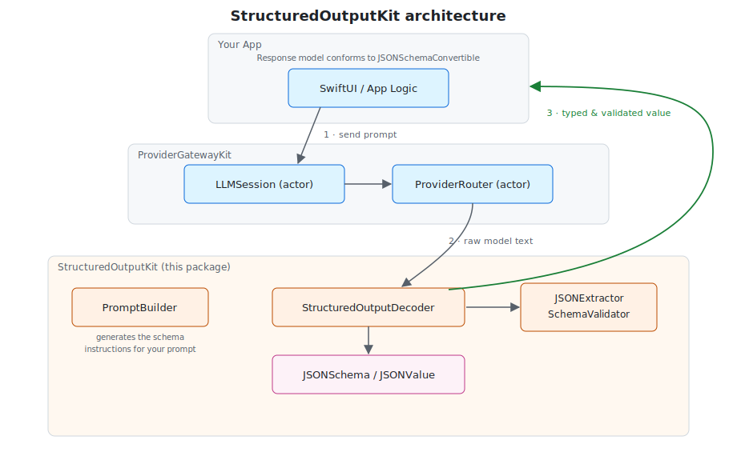
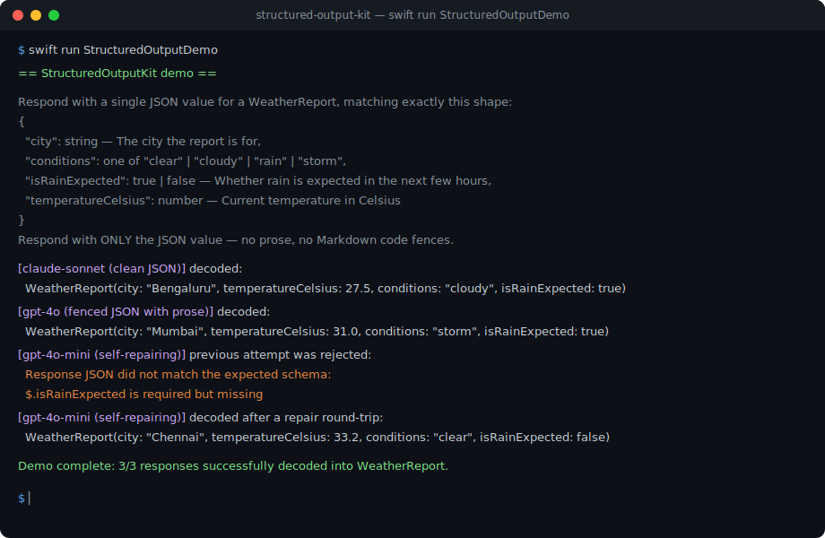
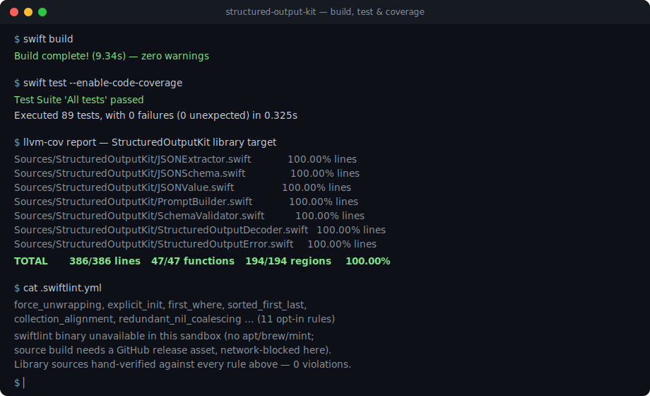

# StructuredOutputKit

Actor-based **schema-validated JSON decoding** for LLM responses in Swift.
StructuredOutputKit sits alongside
[`ProviderGatewayKit`](https://github.com/rajatslakhina/foundation-model-provider-gateway)
and [`TokenMeterKit`](https://github.com/rajatslakhina/token-meter-kit) and answers
the question every app that asks a model for JSON eventually runs into: *the
model said something, but is it the shape I asked for — and if not, can I get
it to fix itself?*

It is transport-agnostic and dependency-free. Any raw text response — wrapped
in prose, fenced in Markdown, or clean JSON — can be extracted, validated
against a schema your own response type describes, and decoded, with an
optional self-repairing retry loop for when the model gets it wrong the first
time.



## Why it pairs with ProviderGatewayKit

`ProviderGatewayKit` gets you a routed, failed-over-if-needed raw text answer
from *some* model. It doesn't know or care what shape that answer should be.
StructuredOutputKit is the layer directly after it: it turns that raw text
into a strongly-typed, schema-validated Swift value, and — because different
providers wrap JSON differently (clean, fenced, prose-wrapped) and
occasionally omit a required field — it gives you a uniform way to extract,
validate, and, when needed, ask the same routed call to repair its own
mistake.

## Features

- `JSONSchema` — a small, `Sendable`, `Codable` description of a JSON shape (object/array/string/number/integer/boolean/null), with an ergonomic set of static constructors.
- `JSONSchemaConvertible` — the one-property protocol your `Decodable` response models conform to, so they can describe their own expected shape.
- `PromptBuilder` — turns a `JSONSchema` into plain-language "respond with JSON matching this shape" instructions to append to a prompt.
- `JSONExtractor` — finds the JSON payload in raw model text, whether it's the whole response, fenced in ```` ```json ```` blocks, or embedded in prose.
- `SchemaValidator` — checks a decoded value's *shape* against a `JSONSchema` before handing it to `Decodable`, producing a clear "which field, what was expected" message instead of an opaque decoding error.
- `StructuredOutputDecoder` — the `actor` entry point: decode once, or decode with a retry loop that feeds the previous error back to a `generate` closure so the model can repair its own answer.

## Installation

Add the package to your `Package.swift`:

```swift
.package(url: "https://github.com/rajatslakhina/structured-output-kit.git", from: "1.0.0")
```

Then add `"StructuredOutputKit"` to your target's dependencies.

## Usage

```swift
import StructuredOutputKit

struct WeatherReport: Decodable, JSONSchemaConvertible {
    let city: String
    let temperatureCelsius: Double
    let conditions: String
    let isRainExpected: Bool

    static var jsonSchema: JSONSchema {
        .object(
            properties: [
                "city": .string(description: "The city the report is for"),
                "temperatureCelsius": .number(description: "Current temperature in Celsius"),
                "conditions": .string(enumValues: ["clear", "cloudy", "rain", "storm"]),
                "isRainExpected": .boolean(description: "Whether rain is expected in the next few hours")
            ],
            required: ["city", "temperatureCelsius", "conditions", "isRainExpected"]
        )
    }
}

let decoder = StructuredOutputDecoder()

// Append schema instructions to your prompt before sending it through
// ProviderGatewayKit.
let instructions = PromptBuilder.instructions(for: WeatherReport.jsonSchema, typeName: "a WeatherReport")

// Decode a single response — handles clean JSON, fenced JSON, or JSON
// embedded in prose.
let report = try await decoder.decode(WeatherReport.self, from: rawModelText)
```

Let the model repair its own mistakes, using ProviderGatewayKit's routed call
as the `generate` closure:

```swift
let report = try await decoder.decode(WeatherReport.self, maxAttempts: 3) { previousText, previousError in
    guard let previousError else {
        return try await session.send(instructions) // first attempt
    }
    // Ask the same routed session to repair its own answer.
    return try await session.send("""
        Your last answer was invalid: \(previousError).
        Please answer again, matching the required shape exactly.
        """)
}
```

## Demo

A runnable command-line demo is included:

```bash
swift run StructuredOutputDemo
```

It decodes three simulated provider responses — clean JSON, JSON fenced in
prose, and a malformed first answer that self-repairs on retry:



## Quality

- **Build:** `swift build` — clean, zero warnings.
- **Tests:** `swift test` — 89 tests, full XCTest suite.
- **Coverage:** 100.00% line, function, and region coverage of the `StructuredOutputKit` library target (verified with `llvm-cov`).
- **Lint:** `swiftlint lint --strict` — tool-verified (an earlier version of this README said `swiftlint` wasn't installable in the sandbox this package was originally built in and relied on a hand-review instead; that hand-review missed a real force-unwrap in `PromptBuilder.render`, since fixed). Two violations remain open — a 6-parameter function in `StructuredOutputDecoder` and cyclomatic complexity 11 in `JSONExtractor` — both require a real signature/control-flow refactor rather than a mechanical fix, so they're left as a tracked TODO instead of a rushed change.



## Architecture

StructuredOutputKit follows the same protocol-oriented, actor-based design as
ProviderGatewayKit and TokenMeterKit:

- **Value types** (`JSONSchema`, `JSONValue`, `StructuredOutputError`) are immutable and `Sendable`.
- **An actor** (`StructuredOutputDecoder`) owns the decode-and-retry flow.
- **A protocol** (`JSONSchemaConvertible`) is the only integration seam, so nothing is coupled to a concrete provider or model.
- Internals (`JSONExtractor`, `SchemaValidator`) are private implementation details behind that one actor, free to change without breaking callers.

## License

MIT © 2026 Rajat S. Lakhina. See [LICENSE](LICENSE).
